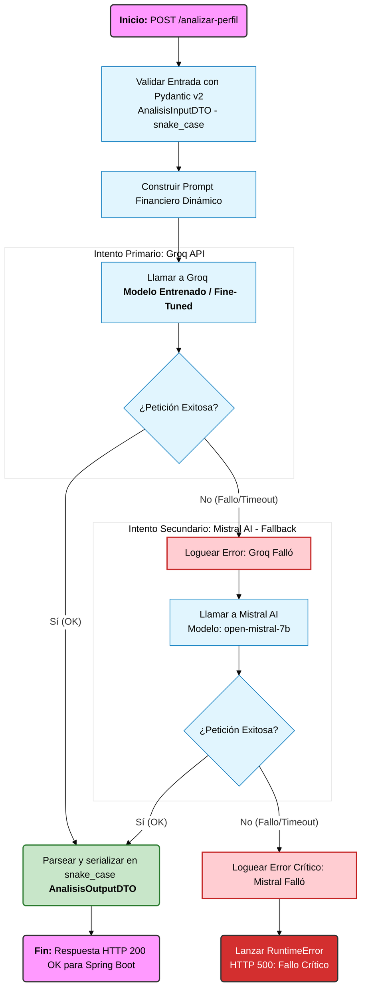
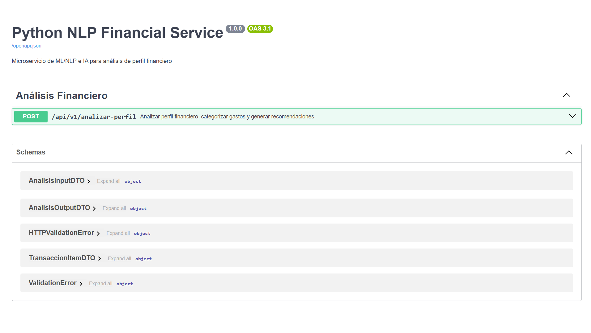
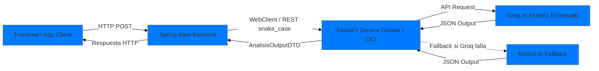

# Python NLP Service - Análisis Financiero Inteligente


Microservicio desarrollado en **Python** con **FastAPI** encargado de procesar datos financieros e interactuar con modelos de lenguaje de gran escala (LLM) a través de la plataforma **Groq** para generar diagnósticos, niveles de riesgo y recomendaciones automatizadas.

---

## 🛠️ Tecnologías y Herramientas

- **Lenguaje:** Python 3.13
- **Framework Web:** FastAPI + Uvicorn
- **Validación de Datos:** Pydantic v2 (estricta compatibilidad `snake_case`)
- **Entrenamiento y Experimentación:** Google Colab / Jupyter Notebooks (`.ipynb`) integrados en VS Code
- **Modelos de IA:**
- **Groq SDK:** Modelo Entrenado / Fine-Tuned *(Proveedor Primario)*
- **Mistral AI SDK:** `mistral-small-latest` *(Proveedor Secundario / Fallback)*
- **Contenedores y Orquestación:** Docker & Docker Compose

---

## 🔄 Diagrama de Resiliencia





## 📁 Estructura del Proyecto


```text
python-nlp-service/
├── app/
│   ├── api/                     # Endpoints y definición de rutas (router.py)
│   ├── models/                  # Modelos de dominio e indicadores financieros
│   ├── schemas/                 # DTOs y contratos Pydantic v2 (analisis.py)
│   └── services/                # Lógica de IA, prompt engineering y fallback (nlp_service.py)
├── notebooks/                   # Entrenamiento y experimentación del modelo
│   ├── raw_data/                # Datos fuentes / sin procesar
│   ├── df_modelo_pf.csv         # Dataset estructurado para el modelo
│   └── entrenamiento_mvp.ipynb  # Notebook de fine-tuning / entrenamiento
├── .env                         # Variables de entorno y llaves de API
├── Dockerfile                   # Configuración del contenedor Docker
├── main.py                      # Punto de entrada de FastAPI
└── requirements.txt
```

🔑 Configuración del Entorno (.env)
Crea un archivo **.env** en la raíz del proyecto con la siguiente estructura (nunca incluir este archivo en el control de versiones):

````
GROQ_API_KEY=gsk_tu_clave_api_de_groq_aqui
MISTRAL_API_KEY=gsk_tu_clave_api_de_groq_aqui
````


🚀 Ejecución en Desarrollo (Local)
1. Crear y activar el entorno virtual

```bash
python -m venv .venv
# En Windows (PowerShell / CMD):
.venv\Scripts\activate
```
2. Instalar dependencias

```bash
pip install -r requirements.txt
```

3. Iniciar el servidor con Hot-Reload

```bash
uvicorn main:app --host 127.0.0.1 --port 8000 --reload
```

___

## 📚 Documentación Interactiva

Una vez iniciado el servicio, puedes acceder a la interfaz Swagger UI para probar endpoints interactivamente:
👉 **http://127.0.0.1:8000/docs**

---

## 🐳 Ejecución con Docker

1. **Construir la imagen de Docker**

```bash
docker build -t python-nlp-service .
```

1- Ejecutar el contenedor

Mapeando el puerto 8000 y pasando el archivo de variables de entorno .env:

```bash
docker run -d -p 8000:8000 --env-file .env --name nlp-container python-nlp-service
```

2- Acceso a la API dentro del contenedor

👉 http://127.0.0.1:8000/docs

___


## 📌 Endpoints de la API

### 1. Verificación de Estado
- **GET** `/health`

**Respuesta HTTP 200 OK:**
```json
{
  "status": "ok",
  "service": "python-nlp"
}
```
2. Análisis de Perfil Financiero
POST **/analizar-perfil**

Estructura de Entrada (**AnalisisInputDTO**) — JSON en **snake_case**:

```json
{
  "usuario_id": "USR-1001",
  "ingreso_mensual": 650000.0,
  "frecuencia_ahorro": "MENSUAL",
  "descripcion": "Supermercado Coto compras semana y pago de suscripciones",
  "valor": 42500.0,
  "ahorro_actual": 120000.0,
  "meta_ahorro": 500000.0,
  "monto_proxima_meta": 100000.0,
  "historial_transacciones": [
    {
      "monto": 15000.0,
      "descripcion": "Combustible",
      "categoria": "Transporte"
    }
  ]
}
```
Estructura de Salida (**AnalisisOutputDTO**) — JSON en **snake_case**:

```json
{
  "perfil_financiero": "Conservador",
  "probabilidad": 0.85,
  "resumen_gastos": {
    "Alimentacion": 42500.0,
    "Transporte": 15000.0
  },
  "recomendaciones": [
    "Mantener el nivel de gasto controlado en supermercado.",
    "Destinar el excedente mensual directamente a la meta de ahorro."
  ],
  "total_gastado": 57500.0,
  "capacidad_ahorro_mensual": 592500.0,
  "porcentaje_tasa_ahorro": 91.15,
  "progreso_meta_ahorro": 24.0,
  "meses_para_meta": 0.64
}
```
## Imagen de swagger



___

## 🗺️ Hoja de Ruta: Integración FastAPI + Backend


___

1. Definir la infraestructura de red (Dónde correrá el contenedor)
Antes de programar en Java, necesitás saber cómo se van a ver ambos servicios:

* En desarrollo local:

* Si ejecutas Spring Boot localmente y FastAPI en Docker (puerto 8000), la URL base del microservicio será:
 
**http://localhost:8000** (o **[http://host.docker.internal:8000]** **(http://host.docker.internal:8000)** si Spring Boot también corre en Docker).

* En producción (ej. OCI / Ubuntu server):

* Desplegar el contenedor de FastAPI en el servidor y, si usás Nginx como Reverse Proxy, exponer el endpoint o mantenerlo en una red interna privada de Docker (**docker-network**) para que solo Spring Boot pueda pegarle por HTTP.

2. Configurar la comunicación en Spring Boot
En tu proyecto backend Java (Spring Boot 3), la forma más eficiente y moderna de consumir este microservicio es con **WebClient** (Spring WebFlux):


___

## Distribución de responsabilidades
FastAPI (Python - **http://localhost:8000/api/v1/analizar-perfil**):

* Procesa y agrupa el historial de transacciones (Pandas + NLP).

* Evalúa métricas numéricas y ejecuta el modelo de Random Forest.

* Llama a los modelos de lenguaje (Groq / Mistral) para redactar las recomendaciones personalizadas.

* Devuelve la respuesta procesada en JSON.

* Spring Boot (Java - Backend principal):

* Gestión de entidades y persistencia: Guardar usuarios, transacciones, metas de ahorro y presupuestos en la base de datos (PostgreSQL/MySQL).

* Procesamiento de archivos: Lectura e ingesta inicial de archivos CSV.

* Seguridad y autenticación: Manejo de JWT, Roles, Login y Registro.

* Orquestación: Recibir la petición del cliente HTTP/Frontend, invocar internamente al microservicio de Python mediante **WebClient/RestTemplate**, aplicar fallbacks en caso de error y retornar la respuesta final unificada.

## Arquitectura de comunicación

````plaintext
[ Cliente / Frontend / Postman ]
               │
               ▼
   [ Java Spring Boot Backend ]  <--->  [ Base de Datos ]
               │
   (Llamada interna WebClient/Feign)
               │
               ▼
 [ Python FastAPI Microservicio ] ───> [ Groq / Mistral AI ]
````

**Tu backend Java actúa como el Gateway y Orquestador principal, mientras que Python es un microservicio de IA especializado que responde bajo demanda.**